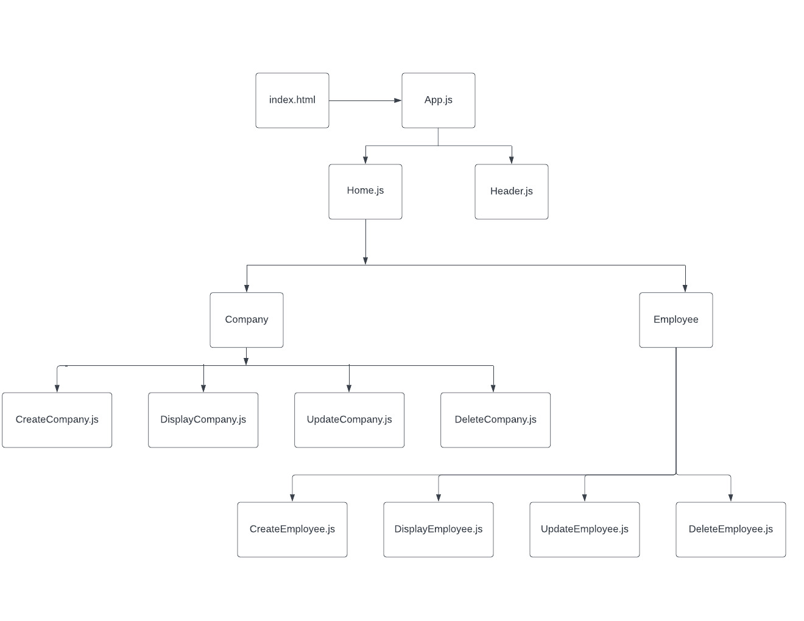
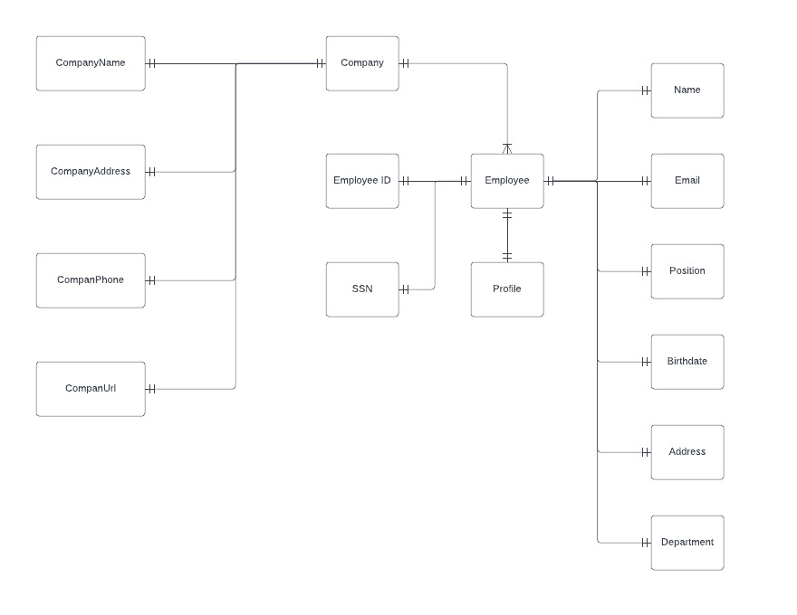

# HR-Management-Systems

# Date: 7/23/2022

## By: Seng Kit Mun / Cedric Mun

## **_Links_**

## Link to my game: [HR Management Systems](https://)

[Trello Progress](https://trello.com/b/63icoQUY/hr-management-systems) | [GitHub](https://github.com/Aonmonomer) | [LinkedIn](https://www.linkedin.com/in/cedric-mun-559820243/)

---

## **_Description_**

### HR-Management-Systems is a website based systems that enable the company HR users to create new company and employee profile and it can also function to display, update and delete the company and personnel profile.

---

## **_Technologies_**

- ## HTML
- ## CSS
- ## JavaScript
- ## React
- ## Mongoose
- ## Express
- ## MongoDB

---

## **_HR-Management-Systems Screenshots_**

---

## **_Credits_**
