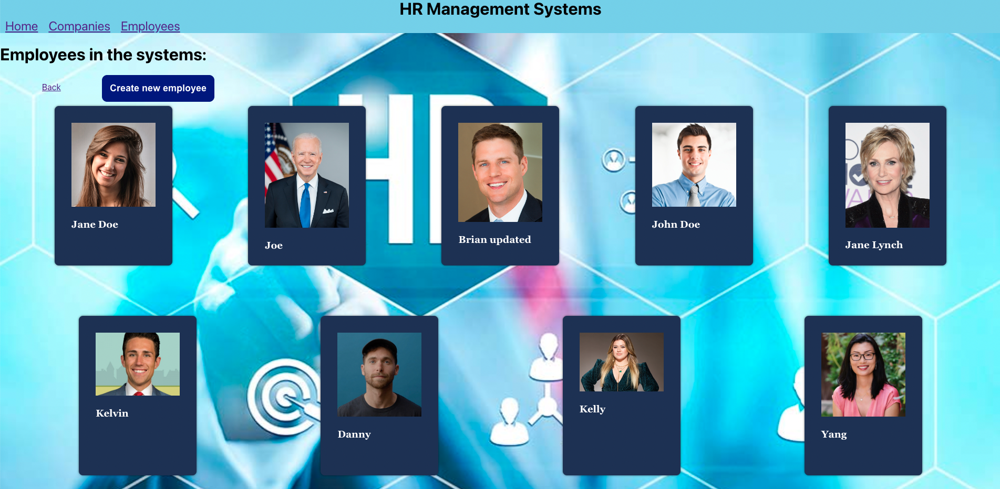

# HR-Management-Systems

# Date: 7/23/2022

## By: Seng Kit Mun / Cedric Mun

## **_Links_**

## Link to HR-Management-Systems: [HR Management Systems](https://glacial-sea-16738.herokuapp.com/)

[Trello Progress](https://trello.com/b/63icoQUY/hr-management-systems) | [GitHub](https://github.com/Aonmonomer) | [LinkedIn](https://www.linkedin.com/in/cedric-mun-559820243/)

---

## **_Description_**

### HR-Management-Systems is a website based systems that enable the company HR users to create new company and employee profile and it can also function to display, update and delete the company and personnel profiles.

---

## **_Technologies_**

- ## HTML
- ## CSS
- ## JavaScript
- ## React
- ## Mongoose
- ## Express
- ## MongoDB

---

## **_HR-Management-Systems Screenshots_**

---

## **_Credits_**

## Project progression: [trello.com](https://trello.com/b/63icoQUY/hr-management-systems)

## Project guide: [github.com](https://github.com/Aonmonomer/HR-Management-Systems)

## HTML and CSS guide: [w3schools.com](https://www.w3schools.com/)

## Drawing ERD and component diagram: [lucidchart.com](https://www.lucidchart.com)

## Image hosting: [imgbb.com](https://imgbb.com/)

## Website deployment: [heroku.com](https://dashboard.heroku.com)

## Image resources: [google.com](https://www.google.com/)
